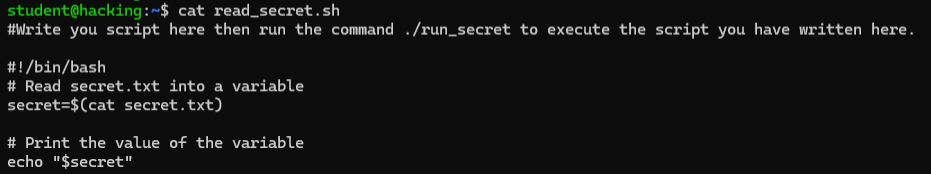

# 🖥️ Task 4 — Bash Scripting

**Platform:** TryHackMe | [tutedude-cybersec room](https://tryhackme.com/jr/tutedude-cybersec)

**Target Machine:** Ubuntu 24.04.4 LTS via SSH (`student@192.168.155.129`)

---

## 📁 Repository Structure

```
CyberSecurity-Task-(Bash Scripting)/
├── Bash_Scripting_Task.docx
├── 4. Bash Scripting.docx.md
├── screenshot.png
├── screenshot_1.png
├── screenshot_2.png
└── README.md
```

---

## 🎯 Objective

Write a Bash script to read the contents of a protected file (`secret.txt`) using `read_secret.sh` and print the output on screen.

---

## ❓ Question & Answer

| # | Question | Answer |
|---|----------|--------|
| 1 | Write a script to read `secret.txt`. What is inside it? | `flag{you_wrote_an_script}` |

---

## 🚩 Flag

```
flag{you_wrote_an_script}
```

---

## 📝 Bash Script Written

File: `read_secret.sh`

```bash
#!/bin/bash
# Read secret.txt into a variable
secret=$(cat secret.txt)

# Print the value of the variable
echo "$secret"
```

---

## 💻 Commands Used

```bash
nano read_secret.sh         # Write the bash script
cat read_secret.sh          # Verify script content
chmod +x read_secret.sh     # Attempt execute permission (not permitted)
./run_secret secret.txt     # Execute via run_secret → flag captured
```

---

## 📸 Screenshots

**Screenshot 1** — Full terminal workflow  


**Screenshot 2** — Flag output  


**Screenshot 3** — Script content  


---

## 🧰 Tools & Environment

- **OS:** Ubuntu 24.04.4 LTS
- **Access:** SSH via PowerShell
- **Platform:** TryHackMe
- **Editor:** nano

---

> Made with 🔥 by [YTxFSGAMERz](https://github.com/YTxFSGAMERz)
