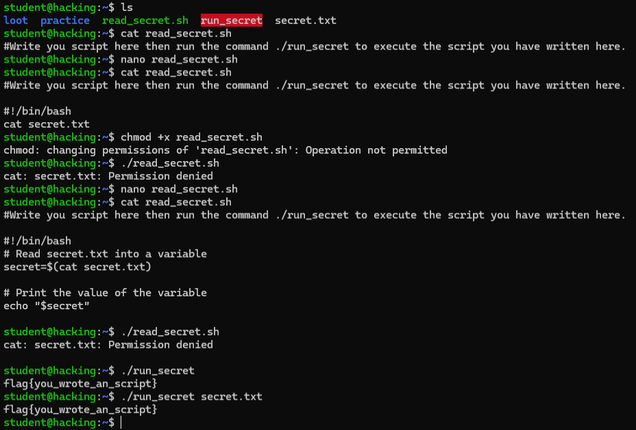
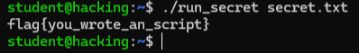
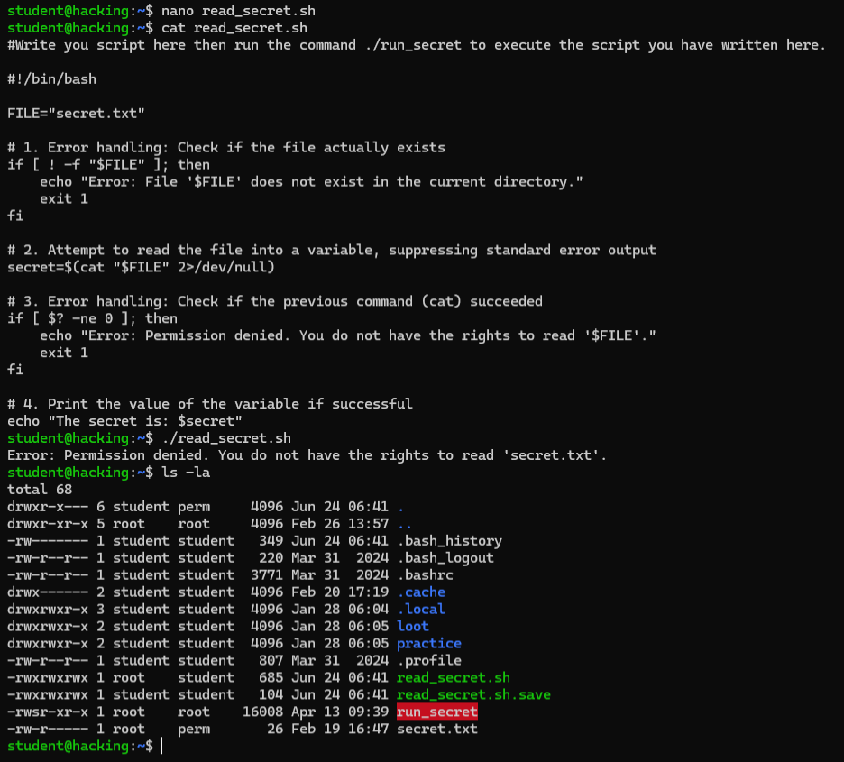

# 🖥️ Task 4 — Bash Scripting

**Platform:** TryHackMe | [tutedude-cybersec room](https://tryhackme.com/jr/tutedude-cybersec)

**Target Machine:** Ubuntu 24.04.4 LTS via SSH (`student@192.168.155.129`)

---

## 📁 Repository Structure

```
CyberSecurity-Task-(Bash Scripting)/
├── Bash_Scripting_Task.docx
├── 4. Bash Scripting.docx.md
├── screenshot.png
├── screenshot_1.png
├── screenshot_3.png
└── README.md
```

---

## 🎯 Objective

Write a Bash script to read the contents of a protected file (`secret.txt`) using `read_secret.sh`, store the content in a variable, and print it on screen.

---

## ❓ Question & Answer

| # | Question | Answer |
|---|----------|--------|
| 1 | Write a script to read `secret.txt`. What is inside it? | `flag{you_wrote_an_script}` |

---

## 🚩 Flag

```
flag{you_wrote_an_script}
```

---

## 📝 Bash Script Written

File: `read_secret.sh`

```bash
#!/bin/bash

FILE="secret.txt"

# 1. Error handling: Check if the file actually exists
if [ ! -f "$FILE" ]; then
    echo "Error: File '$FILE' does not exist in the current directory."
    exit 1
fi

# 2. Attempt to read the file into a variable, suppressing standard error output
secret=$(cat "$FILE" 2>/dev/null)

# 3. Error handling: Check if the previous command (cat) succeeded
if [ $? -ne 0 ]; then
    echo "Error: Permission denied. You do not have the rights to read '$FILE'."
    exit 1
fi

# 4. Print the value of the variable if successful
echo "The secret is: $secret"
```

---

## 💻 Commands Used

```bash
nano read_secret.sh         # Write the bash script
cat read_secret.sh          # Verify script content
chmod +x read_secret.sh     # Attempt execute permission → FAILED (not permitted)
./read_secret.sh            # Direct run → error handling fires: Permission denied
./run_secret secret.txt     # Execute via SUID wrapper → flag captured
```

---

## 🔍 Security Analysis: Permissions & Privilege Escalation

### Why did `chmod +x` fail?

When trying `chmod +x read_secret.sh`, it failed with:
```
chmod: changing permissions of 'read_secret.sh': Operation not permitted
```

Reasons this happens in a locked-down environment:

1. **Ownership Restrictions:** You can only change permissions on files you own. If the file belongs to another user or root, the OS blocks the chmod call.
2. **noexec Mount Flag:** The filesystem or directory may be mounted with the `noexec` flag, preventing any file from being executed directly.
3. **AppArmor / SELinux:** Security modules may be configured to block standard users from making scripts executable.

---

### How did `run_secret` bypass permissions?

From `ls -la`, two key things are visible:

```
-rw-r-----  1 root    perm    26 Feb 19 16:47 secret.txt
-rwsr-xr-x  1 root    root 16008 Apr 13 09:39 run_secret
```

- `secret.txt` → `-rw-r-----  root  perm` — only root and the `perm` group can read it. The `student` user has **no read access**, which is exactly why `./read_secret.sh` triggered the error handler with `Permission denied`.

- `run_secret` → `-rwsr-xr-x  root  root` — notice the **`s` in place of `x`** in the owner's execute bit. This is the **SUID (Set Owner User ID) bit** confirmed live:
  - When SUID is set, the binary executes with the privileges of its **owner (root)**, regardless of who runs it.
  - So `./run_secret secret.txt` temporarily assumed root-level privileges, read the protected file, and returned the flag.
  - The `s` in `-rw**s**r-xr-x` is the smoking gun! 🔫

---

### Alternative Methods to Read Protected Files

In a real-world scenario, if no SUID wrapper exists:

| Method | Command | Description |
|--------|---------|-------------|
| Sudo misconfiguration | `sudo -l` | Check if you can run `cat`, `less`, or `awk` as root without password |
| Other SUID binaries | `find / -perm -4000 2>/dev/null` | Find binaries with SUID set — `base64`, `tar`, `cp` can be abused |
| Cron job injection | `echo "cat secret.txt > /tmp/flag" >> root_cron.sh` | Inject into a writable root-owned cron script |

---

## 📸 Screenshots

**Screenshot 1** — Full terminal workflow


**Screenshot 2** — Flag output


**Screenshot 3** — Security analysis evidence (`ls -la` proving SUID bit + error handling firing)


---

## 🧰 Tools & Environment

- **OS:** Ubuntu 24.04.4 LTS
- **Access:** SSH via PowerShell
- **Platform:** TryHackMe
- **Editor:** nano

---

> Made with 🔥 by [YTxFSGAMERz](https://github.com/YTxFSGAMERz)