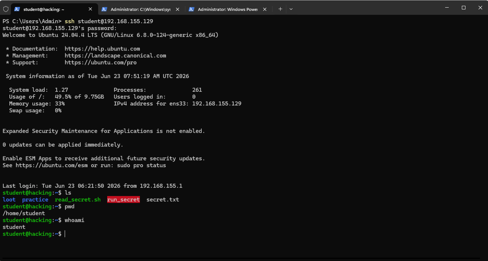

# 🛡️ Cybersecurity

A collection of cybersecurity labs, tasks, and write-ups — covering Linux fundamentals, web security, and ethical hacking concepts.

---

## 📁 Repository Structure

```
Basic-Linux-Commands/     # Linux CLI fundamentals
├── Basic_Linux_Commands_Task.docx
├── 1. Basic Linux Commands.docx.md
└── README.md
```

---

## ✅ Task 1 — Basic Linux Commands

**Platform:** TryHackMe | [tutedude-cybersec room](https://tryhackme.com/jr/tutedude-cybersec)

**Target Machine:** Ubuntu 24.04.4 LTS via SSH (`student@192.168.155.129`)

### Questions & Answers

| # | Question | Answer |
|---|----------|--------|
| 1 | What command shows the current directory? | `pwd` |
| 2 | What is the username you are logged in as? | `student` |

### Commands Used

```bash
pwd        # Print Working Directory → /home/student
whoami     # Print current user    → student
```

### Output Screenshot



---

## 🔐 Web Security Labs

Completed PortSwigger Web Security Academy labs:

- **SQL Injection** — `' OR 1=1--`
- **Reflected XSS** — `<script>alert(1)</script>`

---

## 🧰 Tools & Environment

- **OS:** Ubuntu 24.04.4 LTS
- **Access:** SSH via PowerShell
- **Platform:** TryHackMe

---

> Made with 🔥 by [YTxFSGAMERz](https://github.com/YTxFSGAMERz)
