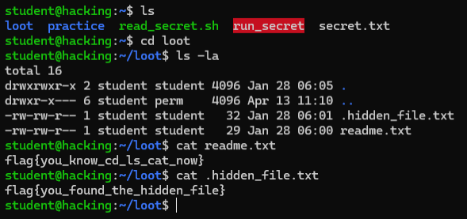

# 📂 Task 3 — File System Commands

**Platform:** TryHackMe | [tutedude-cybersec room](https://tryhackme.com/jr/tutedude-cybersec)

**Target Machine:** Ubuntu 24.04.4 LTS via SSH (`student@192.168.155.129`)

---

## 📁 Repository Structure

```
CyberSecurity-Task-(File System Commands)/
├── File_System_Commands_Task.docx
├── 3. File System Commands.docx.md
├── screenshot.png
└── README.md
```

---

## 🎯 Objective

Perform basic file system commands on the target machine and capture the flags from the `loot` folder.

---

## ❓ Questions & Answers

| # | Question | Answer |
|---|----------|--------|
| 1 | What is the name of the file in the `loot` folder? | `readme.txt` |
| 2 | What are the contents of `readme.txt`? | `flag{you_know_cd_ls_cat_now}` |
| 3 | What are the contents of the hidden file in `loot`? | `flag{you_found_the_hidden_file}` |

---

## 🚩 Flags

```
flag{you_know_cd_ls_cat_now}
flag{you_found_the_hidden_file}
```

---

## 💻 Commands Used

```bash
ls                      # List home directory — spot the loot folder
cd loot                 # Navigate into loot
ls -la                  # List ALL files including hidden ones (.hidden_file.txt)
cat readme.txt          # Read readme.txt → flag 1
cat .hidden_file.txt    # Read hidden file → flag 2
```

---

## 📸 Output Screenshot



---

## 🧰 Tools & Environment

- **OS:** Ubuntu 24.04.4 LTS
- **Access:** SSH via PowerShell
- **Platform:** TryHackMe

---

> Made with 🔥 by [YTxFSGAMERz](https://github.com/YTxFSGAMERz)
