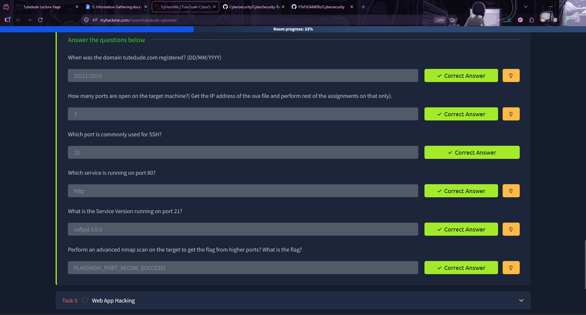

# 🔍 Task 5 — Information Gathering

> **Objective:** Perform Active and Passive reconnaissance on the target to identify open ports and running services.

---

## 📁 Repo Structure

```
CyberSecurity-Task-InfoGathering-FarhanShaikh/
├── 5. Information Gathering.docx.md
├── screenshot.png
├── README.md
└── Information Gathering.docx
```

---

## 📸 TryHackMe — Answered Questions



---

## 🛠️ Tools & Methodology

| Scan Type | Tool | Purpose | Target |
|-----------|------|---------|--------|
| Passive | `whois` | Domain registration lookup | tutedude.com |
| Active | `nmap -p- -sV -T4` | Full port scan + version detection | 192.168.155.129 |

**Why these tools?**
- `whois` — gathers domain metadata without alerting the target (zero footprint)
- `nmap -p-` — scans ALL 65535 ports, not just the default top 1000
- `-sV` — probes each open port for exact service version strings
- `-T4` — aggressive timing for faster results in lab environments

---

## 🧪 Step 1 — Passive Recon (WHOIS)

```bash
┌──(kali㉿kali)-[~]
└─$ whois tutedude.com
   Domain Name: TUTEDUDE.COM
   Creation Date: 2019-11-22T13:10:34Z
   Registrar: GoDaddy.com, LLC
   Name Server: CHRIS.NS.CLOUDFLARE.COM
   DNSSEC: unsigned
```

✅ **Answer:** `22/11/2019`

---

## 🧪 Step 2 — Active Recon (Nmap)

```bash
┌──(kali㉿kali)-[~]
└─$ nmap -p- -sV -T4 192.168.155.129
PORT       STATE  SERVICE      VERSION
21/tcp     open   ftp          vsftpd 3.0.5
22/tcp     open   ssh          OpenSSH 9.6p1 Ubuntu 3ubuntu13.16
80/tcp     open   http         Apache httpd 2.4.58 ((Ubuntu))
139/tcp    open   netbios-ssn  Samba smbd 4
445/tcp    open   netbios-ssn  Samba smbd 4
8080/tcp   open   http         Apache httpd 2.4.58 ((Ubuntu))
65534/tcp  open   unknown      FLAG{HIGH_PORT_RECON_SUCCESS}
```

---

## ✅ Answers

| # | Question | Answer |
|---|----------|--------|
| 1 | When was tutedude.com registered? | **22/11/2019** |
| 2 | How many ports are open? | **7** |
| 3 | Port commonly used for SSH? | **22** |
| 4 | Service on port 80? | **http (Apache httpd 2.4.58)** |
| 5 | Service Version on port 21? | **vsftpd 3.0.5** |
| 6 | Flag from advanced Nmap scan? | **FLAG{HIGH_PORT_RECON_SUCCESS}** |

---

## 🔐 Security Analysis

| Port | Service | Risk | Recommendation |
|------|---------|------|----------------|
| 21 | vsftpd 3.0.5 | Plaintext credentials | Replace with SFTP |
| 22 | OpenSSH 9.6p1 | Low — modern version | Use key-based auth only |
| 80 | Apache 2.4.58 | Unencrypted HTTP | Enforce HTTPS/TLS 1.3 |
| 139/445 | Samba smbd 4 | SMB exploits (EternalBlue) | Firewall-restrict |
| 8080 | Apache 2.4.58 | Often misconfigured | Disable if unused |
| 65534 | Unknown | Suspicious high port / backdoor | Investigate immediately |

---

## 👤 Author

**Farhan Shaikh** | [github.com/YTxFSGAMERz](https://github.com/YTxFSGAMERz)
