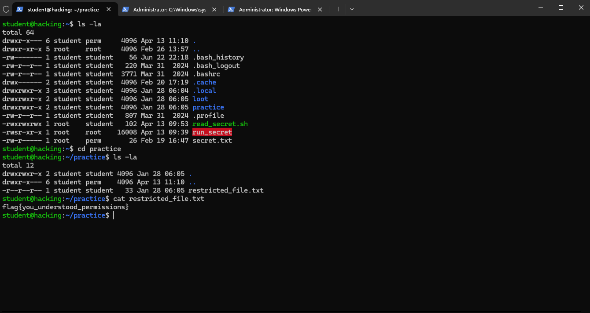

# 🔐 Task 2 — Linux Permissions

**Platform:** TryHackMe | [tutedude-cybersec room](https://tryhackme.com/jr/tutedude-cybersec)

**Target Machine:** Ubuntu 24.04.4 LTS via SSH (`student@192.168.155.129`)

---

## 📁 Repository Structure

```
CyberSecurity-Task-(Linux Permissions)/
├── Linux_Permissions_Task.docx
├── 2. Linux Permissions.docx.md
├── screenshot.png
└── README.md
```

## 🎯 Objective

Understand how permissions work in Linux and read the content of `/home/student/practice/restricted_file.txt`

---

## 🚩 Flag

```
flag{you_understood_permissions}
```

---

## 💻 Commands Used

```bash
ls -la                    # List files with permissions
cd practice               # Navigate to practice directory
cat restricted_file.txt   # Read the restricted file
```

---

## 📸 Output Screenshot



---

## 📖 Key Concepts

| Permission | Meaning |
|------------|---------|
| `r` | Read |
| `w` | Write |
| `x` | Execute |
| `-r--r--r--` | Read-only for owner, group, others |
| `chmod` | Command to change file permissions |

---

> Made with 🔥 by [YTxFSGAMERz](https://github.com/YTxFSGAMERz)
